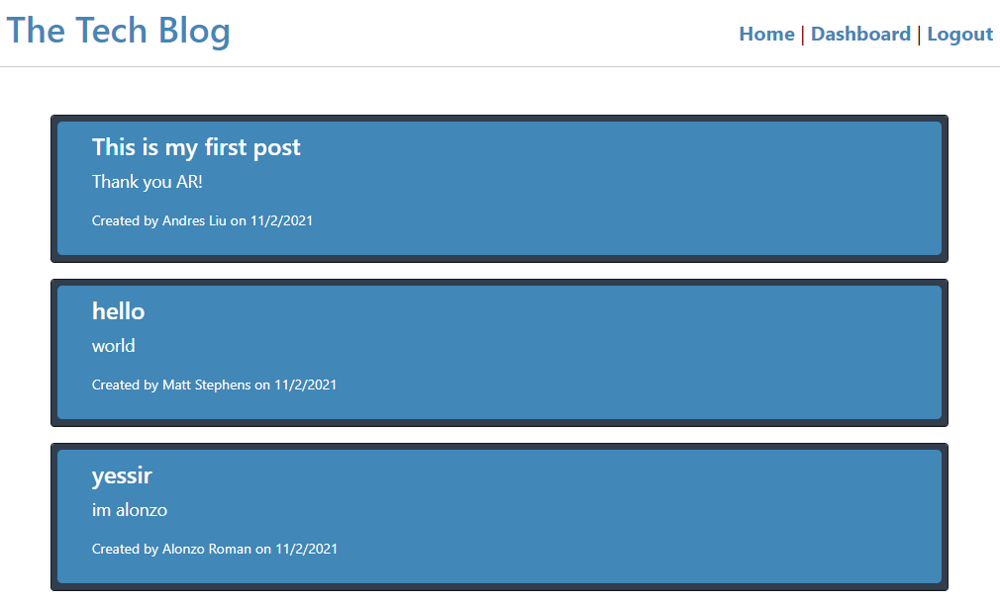

# Tech-Blog

## Description

Create your own posts and comments about Tech in this awesome website where you can talk about any topic with friends or other developers.

## Site Picture

## Getting Started

These instructions will get you a copy of the project up and running on your local machine for development and testing purposes.

* Click on the green button named Code on github and copy the URL of the repository.
* Use the command git clone (repository's URL) to clone all existing project on your local machine.
* Start your testing opening your terminal or command line and going to the repository location on your machine.
* Type the command "npm install" to get the libraries used in this project.
* Create your own .env file and set environment variables of your MySQL username, password and database which are used on connection.js located in the config directory.
* Go to the db directory and run the command "mysql -u (your_username) -p" to enter to MySQL and run command "source schema.sql" to create the database.
* Go to the root directory and type the command "npm run seed" to create the tables on your database based on the models and populate them with data.
* Type the command "npm start" to start the app.
* Open your browser and copy the url with your port of choice and start posting and commenting!

## Prerequisites

* Git
* Node.js
* NPM
* Express
* MySQL

## Installing

* Fork the project to get your own copy of the repository.
* Clone the repository.
* Follow the steps above to manage your E-Commerce Back End.

## Built With

* [Javascript](https://developer.mozilla.org/en-US/docs/Web/javascript)
* [Node.js](https://nodejs.org/en/)
* [NPM](https://docs.npmjs.com/)
* [Express](https://expressjs.com/)
* [MySQL](https://www.mysql.com/)
* [Dotenv](https://www.npmjs.com/package/dotenv)
* [Sequelize](https://sequelize.org/)
* [BcryptJS](https://www.npmjs.com/package/bcryptjs)
* [Express-Handlebars](https://www.npmjs.com/package/express-handlebars)
* [Express-Session](https://www.npmjs.com/package/express-session)

## Deployed Link

* [See Deployed App](https://andresliu-tech-blog.herokuapp.com/)

## Authors

* **Andres Liu** 

## Contacts

- [Link to Portfolio Site](https://andresliu22.github.io/updated-portfolio/)
- [Link to Github](https://github.com/andresliu22/)
- [Link to LinkedIn](https://www.linkedin.com/in/andresliu22/)

## License

This project is licensed under the ISC License.

## Acknowledgments

* Always do some research to get the best possible way to code anything.
* Make the website and code easy to read for viewers and other developers by using brief comments.
* Be use to commit to get an insight of what you have done for each progress you make.

